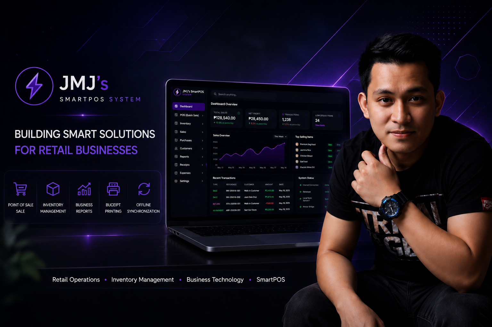

  

  <em>“Turning passion into purpose with combining business, creativity, and technology.”</em>

# 👋 Welcome to my profile  
_BSBA OM Student • Entrepreneur • Brew Master_

  
  
  
  

---

## 📌 About Me  
I balance studies, overseas work, and entrepreneurship.  

- 🎓 **BSBA OM Student (ETEEAP Program)**  
- 💡 **Entrepreneur at JMJ Electrical & Rice Retailing (La Union, PH)**  
- ☕ **Brew Master at Dunkin’ Donuts KSA**  

**Passionate about:**  
- Business operations, strategy, and digital tools  
- Turning my BSBA learnings into practical strategies for our **family business (JMJ)**  
- Exploring ways to grow small enterprises through innovation 

---

## 💼 Tech & Tools I Use  
  
 
    

---

## 🌐 Links  
- 🌍 [**Personal Portfolio / Google Site**](https://sites.google.com/view/jhon-mark-galochino)  
- 💼 [**Canvas Dashboard Lab**](https://canvas.instructure.com/courses/13059782/pages/about-jm)  
- ✉️ [**Email Me**](mailto:jhonmarkgalex68@gmail.com)  

---

## 📂 Featured Works  
- 📊 **Strategic Plan Presentation** – JMJ Electrical & Rice Retailing  
- 🧑‍🤝‍🧑 **Human Resource Plan** – Inspired by Dunkin’ best practices  
- 🌍 **International Business & Trade Projects** – Academic outputs  

### 💻 Canvas Dashboard Lab  
A responsive business dashboard project created using **HTML/CSS** inside *Canvas LMS*, inspired by my real operations at **JMJ Electrical & Rice Retailing**.  
This project combines design, analytics, and entrepreneurship into one clean portfolio piece.  

🔗 [**View Canvas Project →**](https://canvas.instructure.com/courses/13059782/pages/about-jm)

🧠 *Core Skills:* HTML • CSS • Google Sites • Excel • Data Visualization • UI Design  

---

## 📈 GitHub Stats  
  
  
  

---

## 🏆 GitHub Trophies  
  

---

## 📌 Now / What I’m Building  
- 🚀 Expanding **JMJ Electrical & Rice Retailing** — adding digital tracking and improving operations  
- 🧱 Creating **HTML/CSS dashboard prototypes** for business and portfolio use  
- ☕ Enhancing **customer service and daily reporting** at **Dunkin’ KSA**  
- 💡 Exploring **freelance projects** in data entry, dashboards, and Google Sites design  

---

  Made with ❤️ by <b>Jhon Mark Galochino (JMJ)</b> · 
  <a href="https://sites.google.com/view/jhon-mark-galochino">Portfolio</a> · 
  <a href="mailto:jhonmarkgalex68@gmail.com">Email</a>

